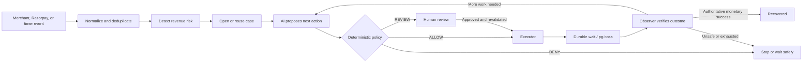

# RecoverAI

**A policy-governed, closed-loop revenue recovery agent for merchants.**

RecoverAI turns payment and commerce events into auditable recovery cases, proposes context-aware next actions with AI, applies deterministic safety policy, executes only approved actions, and waits for authoritative outcome evidence before crediting recovered money.

> **AI proposes. Policy decides. Executor acts. Observer verifies.**

## The Problem

Failed renewals, abandoned checkouts, overdue invoices, and failed payments create recoverable revenue loss. Merchants often handle these signals across disconnected webhook handlers, support tools, spreadsheets, and retry jobs. That makes it difficult to answer three basic questions: what should happen next, whether an action is safe, and whether money was actually recovered.

## What RecoverAI Does

RecoverAI maintains a durable `RevenueRiskCase` for each detected incident and runs a governed recovery loop:



The result is not an unrestricted agent. AI reasoning operates inside an allowlisted action space; policy, persistence, provider adapters, human approval, and recovery verification remain authoritative.

## Why This Is Different

- **Closed loop:** the system observes outcomes and can recover, replan, request review, wait, stop, or exhaust the case.
- **Money truth:** creating a payment link or updating a payment method is progress, not recovered revenue.
- **Deterministic guardrails:** opt-out, consent, quiet hours, cooldowns, limits, compatibility, terminal states, and merchant kill switch are enforced outside the model.
- **Durable execution:** PostgreSQL and pg-boss persist work across process restarts and support idempotent delivery.
- **Auditable decisions:** cases, plan versions, policy decisions, actions, outcomes, reviews, schedules, commitments, and audit events are stored explicitly.
- **Concurrency safety:** atomic claims, compare-and-set transitions, dedupe keys, and a single recovery winner prevent duplicate side effects and double credit.

## Architecture

The monorepo separates the decision and authority boundaries:

- `apps/api` — Fastify API, authenticated tenant boundary, merchant event ingestion, and Razorpay webhook endpoint.
- `apps/worker` — pg-boss consumers, timers, autonomous recovery iterations, and startup composition.
- `apps/web` — React operations UI for Revenue Radar, cases, reviews, policy, and evaluation.
- `packages/core` — detection, AI proposal orchestration, execution, observation, and review services.
- `packages/policy` — deterministic `ALLOW`, `DENY`, and `REVIEW` decisions.
- `packages/integrations` — event normalizers, simulator, Gemini provider, and Razorpay Test Mode payment links/webhooks.
- `packages/db` — Prisma schema, PostgreSQL repositories, migrations, and deterministic demo data.
- `packages/evaluation` — frozen synthetic benchmark harness and artifacts.

See [Architecture](docs/architecture.md) for component, state-machine, webhook, and money-authority diagrams.

## Closed-Loop Recovery Flow

1. An event is normalized into a strict merchant event with a stable identity.
2. The detector opens or reuses the incident's tenant-scoped case.
3. The recovery agent receives observable case history and proposes one structured action from the allowed set.
4. The `PolicyEngine` independently returns `ALLOW`, `DENY`, or `REVIEW`.
5. The executor atomically claims an approved action and uses an internal or provider adapter.
6. Delayed work is persisted before pg-boss handoff; retries converge on deterministic identities.
7. The observer processes authoritative outcomes and either records progress, schedules/replans work, routes to review, stops, or atomically selects the case's recovery winner.

## Revenue-at-Risk Detection

The implemented risk types are:

- `PAYMENT_FAILURE`
- `SUBSCRIPTION_FAILURE`
- `CHECKOUT_ABANDONMENT`
- `OVERDUE_RECEIVABLE`

Detection is currently rules- and event-driven, not a trained predictive model. This makes the control plane explainable, deterministic, and auditable: a reviewer can trace which verified event and business identifier created or suppressed each case.

## AI vs Deterministic Policy

AI is used for contextual diagnosis and structured next-action proposals. The runtime supports Gemini when explicitly configured and a deterministic mock provider for local demos and automated tests.

AI does **not**:

- call payment APIs directly;
- decide whether policy may be bypassed;
- mark a case recovered;
- invent provider success;
- override a hard `DENY`; or
- skip required human review.

No model was trained for this project, and RecoverAI does not claim predictive risk detection. The model proposes from the action set supplied by the orchestrator; deterministic code validates the schema, compatibility, feasibility, and policy decision before execution.

## Razorpay Test Mode Integration

Razorpay support is deliberately limited to **Test Mode**:

- `POST /webhooks/razorpay` verifies the HMAC signature over the exact raw request bytes.
- Verified receipts are persisted and handed to pg-boss for durable, idempotent processing.
- Supported Razorpay payloads are normalized into tenant-scoped authoritative events.
- `CREATE_OR_SEND_PAYMENT_LINK` can use the Razorpay Test Mode adapter and converts the exact case amount to paise.
- `RAZORPAY_TEST_MERCHANT_ID` binds credentials, webhook ingestion, and execution to one configured merchant.
- Live and unrecognized Razorpay key prefixes are rejected by environment validation.

No Razorpay credentials are required for judging. The mock AI and simulator paths provide a deterministic local demo. This repository does not claim that live Razorpay money movement has been tested, and its Razorpay adapter does not retry charges because RecoverAI does not retain payment authorization.

## Recovery Verification / Money Truth

RecoverAI separates activity from settlement:

- Payment-link creation **does not equal** recovered revenue.
- `PAYMENT_METHOD_UPDATED` **does not equal** recovered revenue.
- `verifiedRecovered` counts only exact monetary success backed by authoritative Razorpay or simulator evidence correlated to the case.
- `agentAttributedRecovered` is the subset whose authoritative winning outcome links to a successful RecoverAI action.
- Therefore, `agentAttributedRecovered <= verifiedRecovered`.

Each case can have only one authoritative monetary recovery winner. The winning outcome, recovered amount, and `RECOVERED` transition are committed atomically; duplicate or competing events cannot double-credit the case. Merchant-originated monetary success is not trusted as recovery evidence.

## Human Review & Safety

A `REVIEW` policy decision creates a durable pending review and moves the case to `NEEDS_REVIEW`. Approval authorizes only the exact persisted proposal. Before execution, RecoverAI reloads the case and revalidates current policy; a hard `DENY` still wins. A successful approved transition moves the case from `NEEDS_REVIEW` to `WAITING` before the approved action executes.

Stale plans, concurrent decisions, cross-merchant access, and duplicate approvals fail closed. Reviewers can also reject, take over, or close work. Additional controls include the merchant kill switch, customer opt-out and consent, quiet hours, cooldowns, retry/contact/action limits, recovery windows, compatible-action checks, and a durable audit trail.

## Supported Recovery Actions

| Action                        | Implemented boundary                                                                                         |
| ----------------------------- | ------------------------------------------------------------------------------------------------------------ |
| `RETRY_PAYMENT`               | Governed action; simulated locally. The Razorpay adapter intentionally does not retry charges.               |
| `REQUEST_PAYMENT_UPDATE`      | Simulated communication/provider action.                                                                     |
| `CREATE_OR_SEND_PAYMENT_LINK` | Razorpay Test Mode payment-link adapter when configured; simulator otherwise. Link creation is non-monetary. |
| `SEND_CHECKOUT_RECOVERY`      | Simulated communication/provider action.                                                                     |
| `SEND_RECEIVABLE_REMINDER`    | Simulated communication/provider action.                                                                     |
| `RECORD_PROMISE_TO_PAY`       | Internal durable commitment plus follow-up scheduling.                                                       |
| `SCHEDULE_FOLLOWUP`           | Internal durable scheduled job.                                                                              |
| `ESCALATE_TO_HUMAN`           | Internal human-review routing.                                                                               |
| `STOP_RECOVERY`               | Internal terminal case transition.                                                                           |

## Tech Stack

- TypeScript, Node.js, npm workspaces
- Fastify and Zod
- PostgreSQL 16, Prisma, pg-boss
- React, Vite, Tailwind CSS, TanStack Query
- Gemini provider interface plus deterministic mock provider
- Vitest and Playwright
- GitHub Actions

## Quick Start

Prerequisites: Node.js 18+, npm 9+, and Docker with Docker Compose (or an equivalent local PostgreSQL 16 instance).

```bash
git clone https://github.com/navadeep-17/RecoverAI.git
cd RecoverAI
npm ci
cp .env.example .env
npm run docker:up
npm run demo:setup
```

`demo:setup` generates the Prisma client, applies committed migrations, and seeds the deterministic `recoverai-demo-merchant` tenant. It does not drop schemas or wipe unrelated data.

Start each service in its own terminal:

```bash
npm run dev:api
npm run dev:worker
npm run dev:web
```

Open `http://localhost:5173`. The example environment binds the web development headers to the seeded demo admin. Header-based development authentication is for local demonstration only; production mode requires trusted signed headers.

Demo data commands:

```bash
npm run demo:seed   # idempotently converge the deterministic demo dataset
npm run demo:reset  # delete and recreate only recoverai-demo-merchant
```

## Demo

Run the deterministic closed-loop acceptance trace against PostgreSQL:

```bash
npm run demo
```

The trace uses `MockLLMProvider` and `SIMULATED_RECOVERY_PROVIDER`; it proves orchestration and safety behavior, not Gemini quality or live Razorpay execution. See the [3–5 minute judge guide](docs/DEMO.md) for the UI walkthrough and talk track.

## Evaluation

Evaluation V2 is a deterministic synthetic benchmark, not merchant revenue or a production uplift study. The frozen corpus contains 500 scenarios: 125 for each risk family, split into 300 development, 100 validation, and 100 heldout scenarios. The final heldout comparison used the 100-case heldout split at evaluator checkpoint `f599312bd1e81ea4f9d4d9fc3d2acd880b2d9849` with fingerprint `sha256:f07508e41e4c7a29a1a3c09b2206fa5d7c8cb2dca20a75de9d59e927f8bb8e96`.

| Heldout strategy         | Synthetic recovered | Recovery rate | Unsafe actions | Policy violations |
| ------------------------ | ------------------: | ------------: | -------------: | ----------------: |
| `RULE_BASED_WITH_POLICY` |         ₹334,042.89 |       6.5724% |             24 |                 0 |
| `RECOVERAI`              |         ₹281,695.00 |       5.5425% |             35 |                 0 |

RecoverAI did **not** outperform the Rules+Policy baseline on synthetic recovered amount: the difference was **−₹52,347.89**. It escalated more cases and was not optimized for benchmark recovery yield; it also produced 11 more entries independently classified as unsafe, while deterministic policy prevented policy-violating execution for both strategies. The result demonstrates reproducibility, independent safety scoring, and clear room for proposal-policy improvement—not a revenue-uplift claim.

Frozen artifacts are documented in `packages/evaluation/HELDOUT_RUN.md`. They were not modified for this submission package.

## Repository Structure

```text
apps/
  api/          HTTP, auth, merchant events, Razorpay webhook boundary
  worker/       pg-boss consumers and recovery runtime
  web/          merchant operations dashboard
packages/
  core/         detection, agent, orchestration, execution, observation, review
  db/           Prisma schema, repositories, migrations, demo seed/reset
  policy/       deterministic safety decisions
  integrations/ providers and event normalizers
  shared/       contracts, schemas, money, errors, logging
  evaluation/   frozen deterministic benchmark
docs/
  DEMO.md       judge walkthrough
  architecture.md architecture reference
  SUBMISSION.md concise submission copy
```

## Security / Test-Mode Guarantees

- No real credentials are committed; `.env.example` contains safe placeholders.
- Razorpay execution accepts Test Mode keys only and requires explicit merchant binding.
- Local and CI execution use mocks/simulators unless Test Mode is deliberately configured.
- Webhook signatures are verified before events become authoritative.
- Tenant ownership is checked at repository and API boundaries.
- Secrets are excluded from public action/review DTOs and structured audit summaries.
- Idempotency and atomic state transitions protect external dispatch and monetary credit.

## Limitations / Current Scope

- Razorpay integration is Test Mode only; no live money movement is claimed.
- Only Razorpay payment-link creation is implemented as a real external payment action; charge retries and communications are simulated.
- Revenue-risk detection is event/rule driven, not predictive ML.
- Local development authentication is header based; production mode expects a trusted gateway that signs identity headers.
- The benchmark is synthetic and does not establish real merchant revenue lift.
- Provider breadth, deployment infrastructure, and production observability remain future work.
