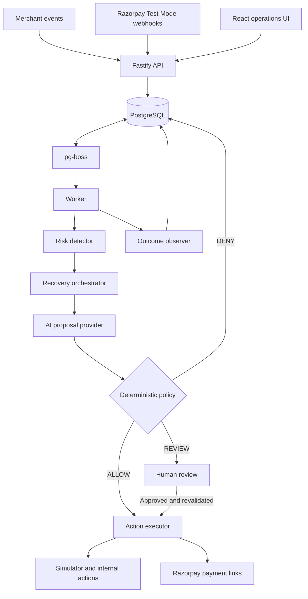
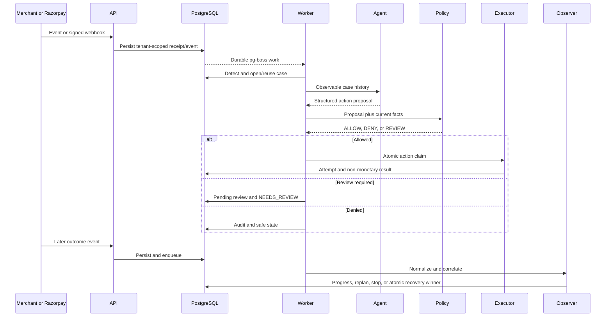
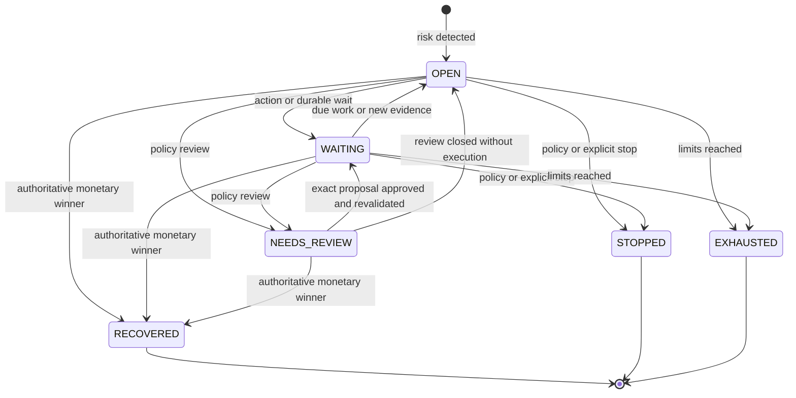
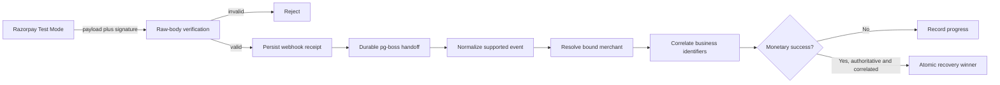

# RecoverAI Architecture

RecoverAI is a policy-governed, closed-loop revenue recovery system. Its central design rule is: **AI proposes, policy decides, executor acts, observer verifies.** PostgreSQL is the durable source of truth for every case, decision, action, wait, review, and outcome.

## Components

| Boundary                  | Responsibility                                                                                                            |
| ------------------------- | ------------------------------------------------------------------------------------------------------------------------- |
| API                       | Authenticates a tenant principal, validates input, verifies Razorpay signatures, and persists inbound events.             |
| Database and repositories | Hold authoritative domain state and enforce tenant ownership, uniqueness, atomic claims, and compare-and-set transitions. |
| pg-boss worker            | Delivers durable event and timer work from PostgreSQL.                                                                    |
| Detector                  | Converts supported events and due timers into new or existing revenue-risk cases.                                         |
| Recovery orchestrator     | Builds observable context, requests one structured proposal, validates it, and invokes policy.                            |
| Policy engine             | Returns deterministic `ALLOW`, `DENY`, or `REVIEW` from merchant, customer, case, and action facts.                       |
| Executor                  | Claims an approved action once and dispatches only to an allowlisted provider or internal handler.                        |
| Outcome observer          | Records progress and accepts monetary recovery only from authoritative, correlated evidence.                              |
| Web app                   | Displays Revenue Radar, cases, policy, reviews, and the frozen synthetic evaluation.                                      |

## Event-to-Outcome Sequence

## Case Lifecycle

Terminal cases are not silently reopened by later planning. State changes that compete with execution or recovery use atomic checks so stale workers fail closed.

## AI, Policy, and Execution Authority

The AI boundary receives only observable case context and the action types made available by orchestration. Its response must pass a strict schema and compatibility validation. The model cannot call providers, mutate a case, override policy, or declare recovery.

The deterministic policy layer owns authorization. It evaluates opt-out and consent, quiet hours, cooldowns, recovery windows, retry/contact/action limits, high-value review thresholds, terminal state, merchant kill switch, and action compatibility. A review approval applies only to the exact stored proposal and triggers a fresh policy evaluation before execution.

The executor then atomically claims the action. Provider calls carry deterministic idempotency identities; duplicate deliveries converge on the same recorded work rather than creating a second external side effect.

## Durable Scheduling and Idempotency

- Inbound event identities are tenant scoped and unique.
- PostgreSQL persists jobs, promises, follow-ups, attempts, and audit records before asynchronous handoff is considered complete.
- pg-boss provides database-backed delivery for worker jobs and timers.
- Action and outcome repositories treat expected uniqueness conflicts as idempotent replay where appropriate.
- Atomic case transitions prevent stale plans and concurrent workers from overwriting a newer decision.
- One authoritative recovery winner prevents duplicate webhooks or competing providers from double-crediting money.

## Razorpay Webhook Authority

The signature is computed over the exact raw bytes. Credentials and ingestion are bound to `RAZORPAY_TEST_MERCHANT_ID`, and environment validation rejects live or unknown Razorpay key prefixes. Payment-link creation sends the authoritative case amount in paise, but it remains non-monetary until a later authoritative event is verified and correlated.

## Money Authority

A monetary event may recover a case only when all relevant checks succeed:

- its source is authoritative (`RAZORPAY` or the deterministic `SIMULATOR`);
- its merchant and business identifiers correlate to the case;
- its amount and currency satisfy the case's money rules;
- it has not already lost the case's single-winner race; and
- attribution, when claimed, links the winner to a successful RecoverAI action.

Merchant-originated `PAYMENT_SUCCEEDED`, `CHECKOUT_COMPLETED`, or `INVOICE_PAID` events can be stored and audited but are rejected as monetary authority. Payment-link creation and payment-method updates are also explicitly non-monetary.

## Trust and Deployment Scope

- Local demos use header-based development identity and deterministic mocks; production mode expects trusted signed identity headers.
- Razorpay integration is Test Mode only and limited to payment-link creation plus verified webhooks.
- Other communication/payment actions are simulated; promises, schedules, escalation, and stop are internal durable actions.
- The repository includes application composition and CI, not a hosted production deployment.
- Evaluation data is synthetic and frozen; it is not evidence of real-world revenue uplift.
